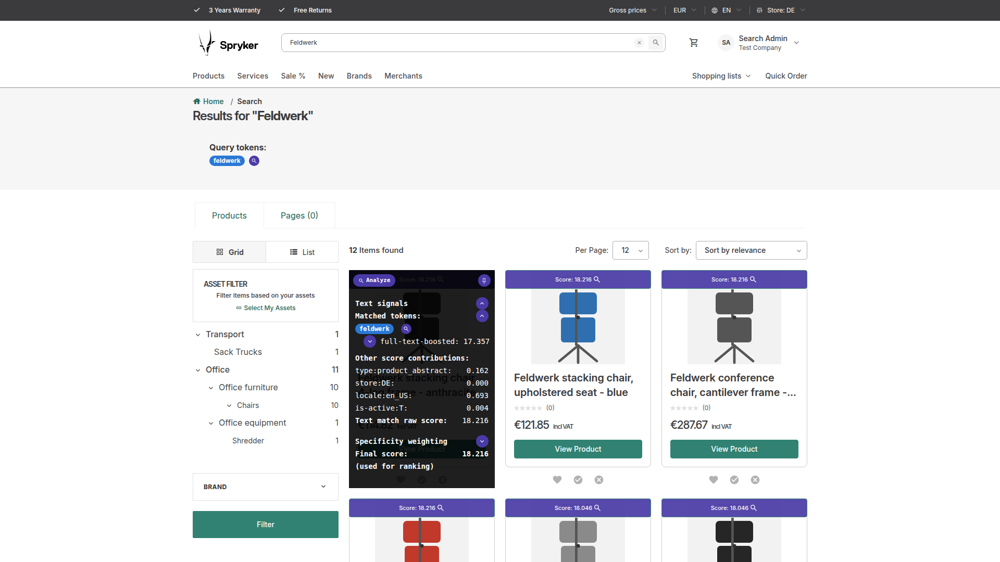
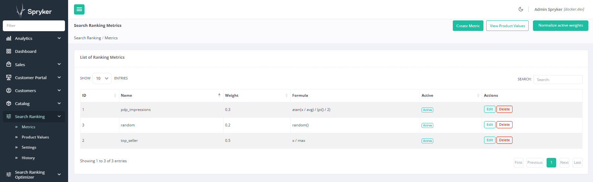
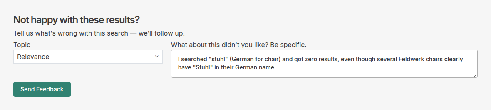

# Spryker Search Toolkit

[](https://github.com/andrebarthelmeshellmuth/spryker-search-toolkit/actions/workflows/ci.yml)
[](#whats-included)
[](LICENSE)

This is a `type: metapackage` with no PHP source of its own, so it skips the PHP-version and
PHPStan badges every bundled package carries — there's no code for either to describe here. The
CI badge instead reflects the one check that does apply: `composer validate --strict` on this
package's own `composer.json`.

A single `composer require` for the whole Spryker search toolkit. This package carries no code of
its own — it exists purely to pull in [search-debug](https://github.com/andrebarthelmeshellmuth/spryker-search-debugger),
[search-ranking](https://github.com/andrebarthelmeshellmuth/spryker-search-ranking),
[search-ranking-optimizer](https://github.com/andrebarthelmeshellmuth/spryker-search-ranking-optimizer),
[search-feedback](https://github.com/andrebarthelmeshellmuth/spryker-search-feedback),
[search-variant-facets](https://github.com/andrebarthelmeshellmuth/spryker-search-variant-facets), and
[search-index-alias](https://github.com/andrebarthelmeshellmuth/spryker-search-index-alias)
together at versions that are known to work with each other.

Each member package stays independently installable and focused on one concern (explainability,
ranking mechanism, tuning, cross-facet indexing, no-downtime index management). search-index-alias
and search-variant-facets are search tooling that isn't about relevance scoring — a no-downtime
settings/mapping change via alias swap, and correct cross-facet indexing, respectively — landing as
sibling packages under this same toolkit rather than bolted onto the relevance packages above.

*Part of the [Search Relevance](https://search-relevance.dev/) project — explore the interactive ranking-formula walkthrough there.*

## Contents

- [Quick summary](#quick-summary)
- [What's included](#whats-included)
- [Status](#status)
- [Installation](#installation)
- [Versioning](#versioning)
- [License](#license)

## Quick summary

One screenshot per bundled package, and the top thing (or two, or three) it actually does for you.

### [search-debug](https://github.com/andrebarthelmeshellmuth/spryker-search-debugger)



- Explains exactly how a product earned its position on the results page: which database field
  matched, what the analyzer chain turned that field's value into, and how each piece contributed
  to the final score.
- The overlay widget itself is open for extension — other packages (search-ranking included)
  register their own contribution rows into it rather than needing a competing UI.

### [search-ranking](https://github.com/andrebarthelmeshellmuth/spryker-search-ranking)



- Lets you define weighted business metrics per store, so ranking stops being pure text
  relevance — margin, stock, conversion rate, or whatever signal matters, as long as each product
  carries that data.
- Blends those metrics into Elasticsearch/OpenSearch's `function_score` query alongside text
  relevance, with a relevance-weight knob to shift the balance between the two.

### [search-ranking-optimizer](https://github.com/andrebarthelmeshellmuth/spryker-search-ranking-optimizer)


- Lets admins rate how good a query's results actually are, building up a relevance-judgment set
  from real feedback instead of guesswork.
- Feeds those ratings into [blackbox-optimizer](https://github.com/andrebarthelmeshellmuth/blackbox-optimizer)
  (CMA-ES or Differential Evolution) to automatically tune search-ranking's formula weights,
  scored against nDCG@10.

### [search-feedback](https://github.com/andrebarthelmeshellmuth/spryker-search-feedback)



- Lets a storefront user file a ticket about a specific search-results page straight from the
  page they're looking at, without needing to describe what they searched for.
- The Zed admin who picks it up can replay the *exact* result set the ticket-filer saw — not "run
  this search now," but "run it as it looked back then" — and, if search-debug is installed, dig
  into exactly how each of those historical scores was calculated.

### [search-variant-facets](https://github.com/andrebarthelmeshellmuth/spryker-search-variant-facets)


- Fixes a real gap in Spryker core's facet indexing: core can return an abstract product even
  when no single one of its concretes/variants actually matches every selected facet value at
  once (an OR-across-concretes leak). This package makes cross-facet selections match only
  concretes that genuinely carry the full combination.

### [search-index-alias](https://github.com/andrebarthelmeshellmuth/spryker-search-index-alias)


- Introduces no-downtime index switches: rebuild a search index in the background, verify it,
  then flip an alias to it instead of updating an index in place.
- A flip can be flagged to happen automatically as part of the next deployment, instead of
  requiring someone to trigger it by hand.

## What's included

| Package | Role |
|---|---|
| [search-debug](https://github.com/andrebarthelmeshellmuth/spryker-search-debugger) | Per-product Elasticsearch/OpenSearch score and token overlay — explains why a result ranked where it did. |
| [search-ranking](https://github.com/andrebarthelmeshellmuth/spryker-search-ranking) | The ranking mechanism: business-signal metrics, normalization, and `function_score` ranking. |
| [search-ranking-optimizer](https://github.com/andrebarthelmeshellmuth/spryker-search-ranking-optimizer) | The tuning layer on top: calibration, relevance judgments, rank evaluation, and weight optimization. |
| [search-feedback](https://github.com/andrebarthelmeshellmuth/spryker-search-feedback) | SRP feedback ticketing: lets an authorized storefront admin file a ticket about a set of search results. |
| [search-variant-facets](https://github.com/andrebarthelmeshellmuth/spryker-search-variant-facets) | Fixes Spryker core's OR-across-concretes facet indexing: cross-facet selections match only concretes that actually carry the combination. |
| [search-index-alias](https://github.com/andrebarthelmeshellmuth/spryker-search-index-alias) | Zed blue/green search-index management via aliases: rebuild and flip an index with no storefront downtime. |

## Status

Stable. Every member package has reached a stable release, and this bundle pins them as a verified
set:

| Package | Pinned at |
|---|---|
| search-debug | `^1.3.2` |
| search-ranking | `^2.3.3` |
| search-ranking-optimizer | `^2.0.0` |
| search-feedback | `^1.4.2` |
| search-variant-facets | `^1.0.0` |
| search-index-alias | `^1.0.0` |

One caveat is unchanged, and it is about distribution, not maturity: all six member packages, and
this bundle, live under the `spryker-community` vendor namespace, which is not yet on Packagist (the
name is held by an unrelated GitHub organization; resolving this is tracked separately). Until that's
resolved, installation requires the manual VCS repository step below.

`search-ranking-optimizer` also transitively requires
[`andrebarthelmeshellmuth/blackbox-optimizer`](https://github.com/andrebarthelmeshellmuth/blackbox-optimizer),
which is likewise not yet on Packagist — see the note under [Installation](#installation).

## Installation

Once every member package (and blackbox-optimizer) is published to Packagist, installing the whole
toolkit will be:

```
composer require spryker-community/search-toolkit
```

**Today**, add a VCS repository entry per package to your own project's `composer.json`. This is
required for all seven packages below **and** for `blackbox-optimizer`, even though
`search-ranking-optimizer`'s own `composer.json` already declares a repository for it — Composer
only reads `repositories` from the *root* project, never from a dependency's own `composer.json`,
so every non-Packagist package anywhere in the graph has to be re-declared by whoever sits at the
root. (This mirrors what this project's own demoshop does — see its `composer.json`.)

```json
{
    "repositories": [
        { "type": "vcs", "url": "https://github.com/andrebarthelmeshellmuth/spryker-search-debugger" },
        { "type": "vcs", "url": "https://github.com/andrebarthelmeshellmuth/spryker-search-ranking" },
        { "type": "vcs", "url": "https://github.com/andrebarthelmeshellmuth/spryker-search-ranking-optimizer" },
        { "type": "vcs", "url": "https://github.com/andrebarthelmeshellmuth/spryker-search-feedback" },
        { "type": "vcs", "url": "https://github.com/andrebarthelmeshellmuth/spryker-search-variant-facets" },
        { "type": "vcs", "url": "https://github.com/andrebarthelmeshellmuth/spryker-search-index-alias" },
        { "type": "vcs", "url": "https://github.com/andrebarthelmeshellmuth/spryker-search-toolkit" },
        { "type": "vcs", "url": "https://github.com/andrebarthelmeshellmuth/blackbox-optimizer" }
    ],
    "require": {
        "spryker-community/search-toolkit": "^1.2.0"
    }
}
```

then `composer update`.

## Versioning

This package has no code, so its version tracks *compatible combinations*, not behavior. Its
`require` floors are bumped whenever a member package ships a new major or minor release that this
bundle has been verified against — and, as a patch bump, whenever a new member package joins the
bundle at all (adding `search-feedback` was one such patch bump, even though nothing existing
changed).

`1.0.0` marks the point where every member package is itself at a stable release, rather than any
change in what this bundle does. Note that two of the floors it raised were not merely stale but
wrong: the previous `^1.3.0` for search-ranking excluded its entire 2.x line, and `^0.9.1` for
search-ranking-optimizer excluded its 1.0.0 — so pre-1.0.0 tags of this bundle resolve to a set that
no longer reflects the packages' current releases.

`1.2.0` adds `search-variant-facets` and `search-index-alias` as new bundled members and raises
`search-ranking-optimizer`'s floor to its `2.0.0` line, alongside patch-level floor bumps for
search-debug, search-ranking, and search-feedback. Use `^1.2.0`.

## License

MIT, see [LICENSE](LICENSE).
